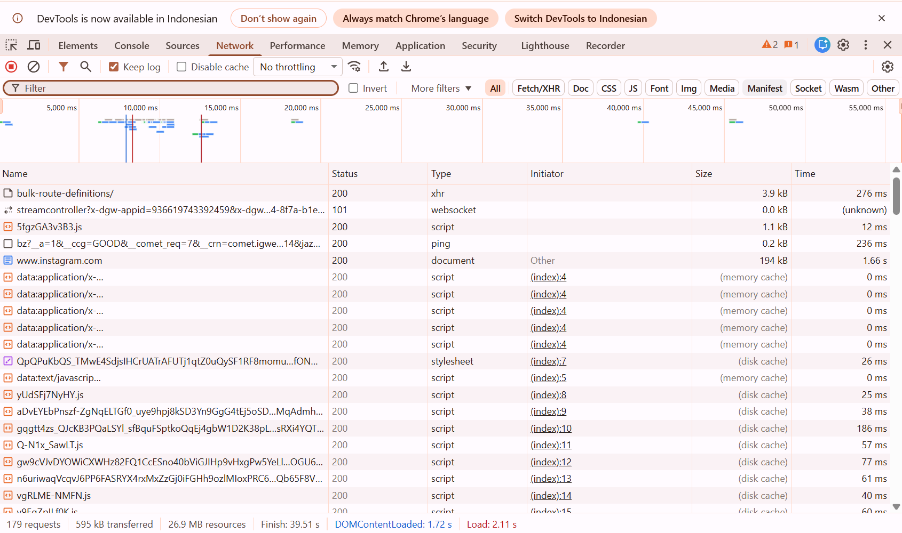
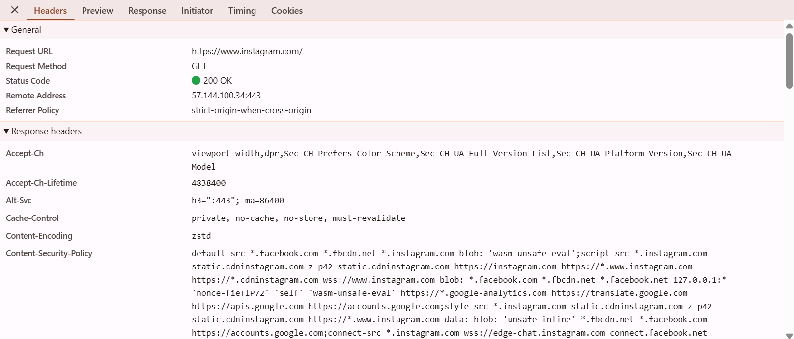
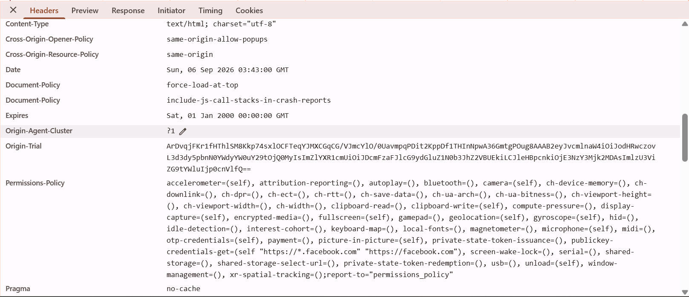
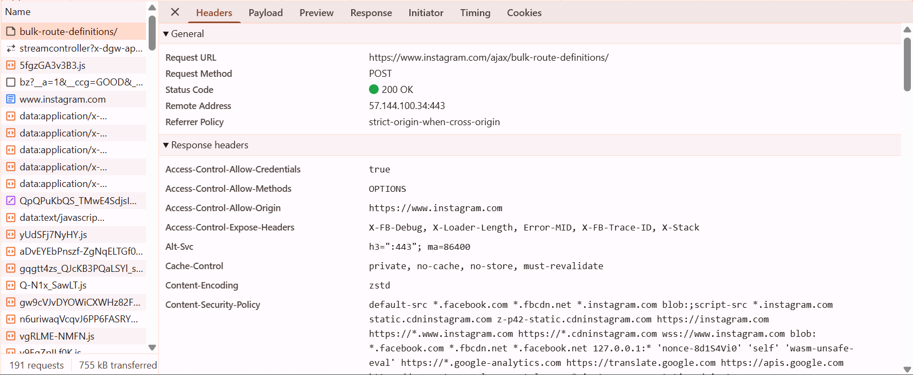
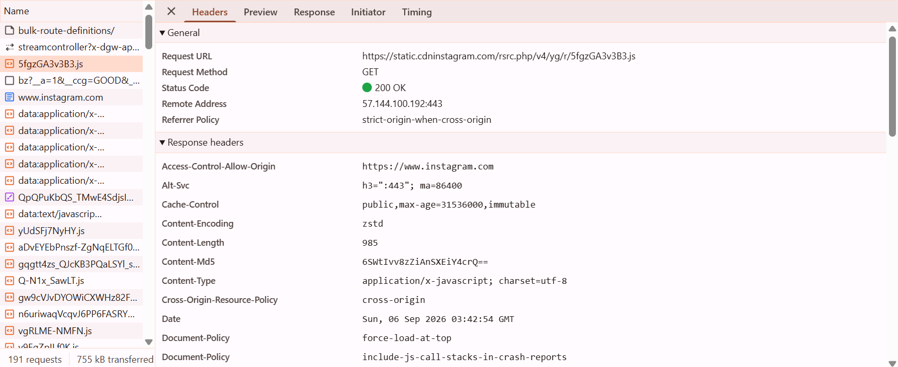
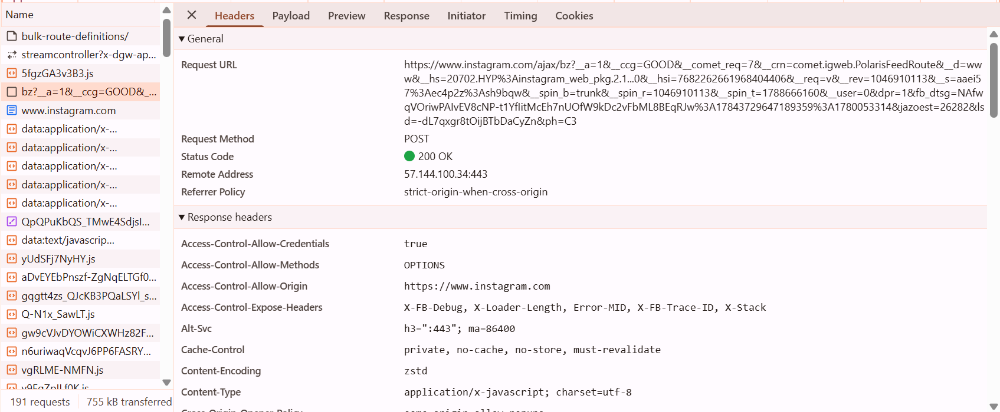
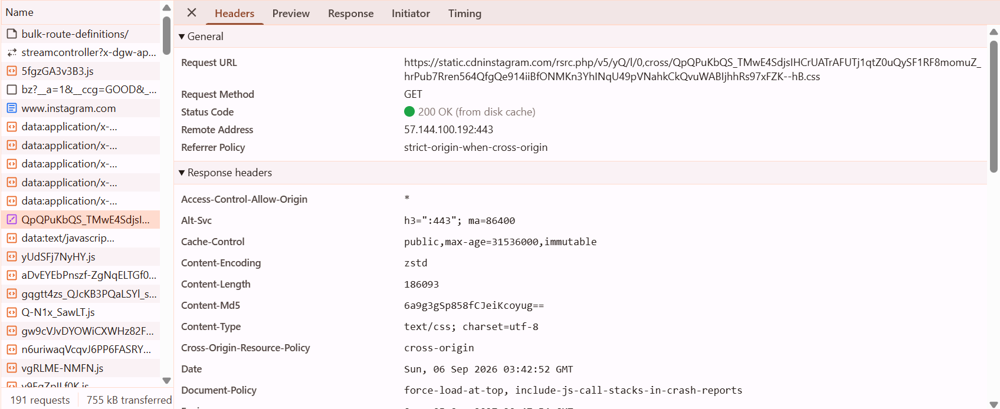
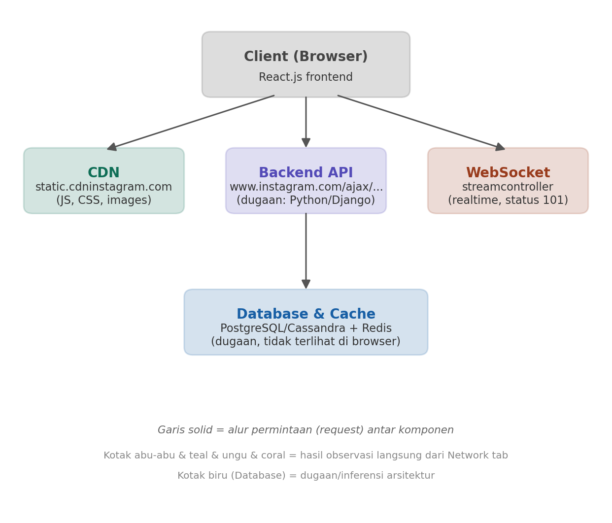

# Tugas Pertemuan 1 — Web Request Investigation

**Nama:** _(Hilwa Hilyatun Niswah)_
**Aplikasi yang diinvestigasi:** Instagram (versi web)
**Tanggal investigasi:** 6 September 2026

---

## 1. Identifikasi Aplikasi

| Item | Keterangan |
|---|---|
| Nama aplikasi | Instagram |
| URL utama | `https://www.instagram.com/` |

### Anatomi URL

| Komponen | Contoh | Penjelasan |
|---|---|---|
| Protocol | `https://` | Protokol aman (HTTP dengan enkripsi TLS/SSL) |
| Subdomain | `www` | Sub-domain standar untuk versi web |
| Domain | `instagram` | Nama domain utama |
| TLD (Top-Level Domain) | `.com` | Domain komersial |
| Path | `/` (atau `/username/` untuk halaman profil) | Menunjukkan resource/halaman spesifik |

---

## 2. Screenshot Network Tab

Tangkapan layar Network tab DevTools saat halaman utama Instagram dimuat:

Terlihat total 179 request dengan berbagai tipe: `document`, `xhr`, `script`, `stylesheet`, `websocket`, dan `ping`.

---

## 3. Lima HTTP Request

| No | Method | URL Endpoint | Status | Content-Type | Fungsi |
|---|---|---|---|---|---|
| 1 | GET | `https://www.instagram.com/` | 200 OK | `text/html; charset="utf-8"` | Halaman utama (dokumen HTML) |
| 2 | POST | `https://www.instagram.com/ajax/bulk-route-definitions/` | 200 OK | `text/javascript; charset=utf-8` | Data routing untuk SPA (Single Page Application) |
| 3 | GET | `https://static.cdninstagram.com/rsrc.php/v4/yg/r/5fgzGA3v3B3.js` | 200 OK | `application/x-javascript; charset=utf-8` | File JavaScript dari CDN |
| 4 | POST | `https://www.instagram.com/ajax/bz?__a=1&__ccg=GOOD&...` | 200 OK | `application/x-javascript; charset=utf-8` | Logging / analytics (tracking pixel) |
| 5 | GET | `https://static.cdninstagram.com/rsrc.php/v5/yQ/l/0,cross/QpQPuKbQS_...hB.css` | 200 OK (dari disk cache) | `text/css; charset=utf-8` | File CSS styling dari CDN |

### Bukti (screenshot Headers tiap request)

**Request 1 — dokumen HTML**

**Request 2 — bulk-route-definitions**

**Request 3 — file JavaScript (CDN)**

**Request 4 — ping/tracking**

**Request 5 — file CSS (CDN)**

---

## 4. Analisis Arsitektur

Berdasarkan pengamatan pada Network tab:

**Frontend**
- Kemungkinan besar dibangun dengan **React.js** — terindikasi dari pola *Single Page Application* (SPA): ada request khusus `bulk-route-definitions` yang dipakai untuk routing halaman tanpa perlu reload penuh.
- File JS dan CSS di-*serve* dari domain terpisah, bukan dari `www.instagram.com` langsung.

**Backend**
- Ditemukan endpoint API di path `/ajax/...` (contoh: `/ajax/bulk-route-definitions/`, `/ajax/bz`) yang menunjukkan adanya **backend API internal**.
- Ada koneksi **WebSocket** (`streamcontroller`, status `101 Switching Protocols`) yang dipakai untuk fitur realtime seperti notifikasi atau pesan langsung (DM).
- Dugaan teknologi: **Python/Django** atau infrastruktur backend internal Meta lainnya (tidak bisa dipastikan 100% hanya dari Network tab).

**Database** *(dugaan, tidak terlihat langsung dari browser)*
- Kemungkinan **PostgreSQL** atau **Cassandra** untuk penyimpanan data utama (user, postingan).
- Kemungkinan **Redis/Memcached** untuk caching data yang sering diakses agar respons lebih cepat.
- Catatan: bagian ini murni inferensi berdasarkan pengetahuan umum arsitektur skala besar seperti Instagram, karena database tidak pernah terlihat langsung dari sisi client/browser.

**CDN (Content Delivery Network)**
- Domain `static.cdninstagram.com` dipakai khusus untuk mendistribusikan file statis (JS, CSS, gambar) agar loading lebih cepat karena disebar ke banyak server di berbagai lokasi.

---

## 5. Diagram Arsitektur

**Penjelasan diagram:**
1. **Client (Browser)** memuat halaman dan mengirim tiga jenis permintaan paralel.
2. **CDN** menyediakan file statis (JS, CSS, gambar) — hasil observasi langsung.
3. **Backend API** menangani data dinamis lewat endpoint `/ajax/...` — hasil observasi langsung.
4. **WebSocket** membuka koneksi realtime untuk update instan — hasil observasi langsung.
5. **Database & Cache** diakses oleh Backend API untuk menyimpan/mengambil data — ini bagian **dugaan/inferensi**, karena tidak terlihat langsung dari Network tab.

---

## Kesimpulan

Dari investigasi ini terlihat bahwa Instagram web menggunakan arsitektur modern berbasis **SPA (Single Page Application)** dengan pemisahan yang jelas antara:
- penyajian konten statis (lewat CDN),
- pemrosesan data dinamis (lewat backend API berbasis `/ajax/`), dan
- komunikasi realtime (lewat WebSocket).

Pendekatan ini umum dipakai aplikasi web skala besar karena membuat loading lebih cepat (aset statis di-cache di CDN) dan pengalaman pengguna lebih mulus (tidak perlu reload halaman penuh setiap berpindah tampilan).
'Add week 1 report'
